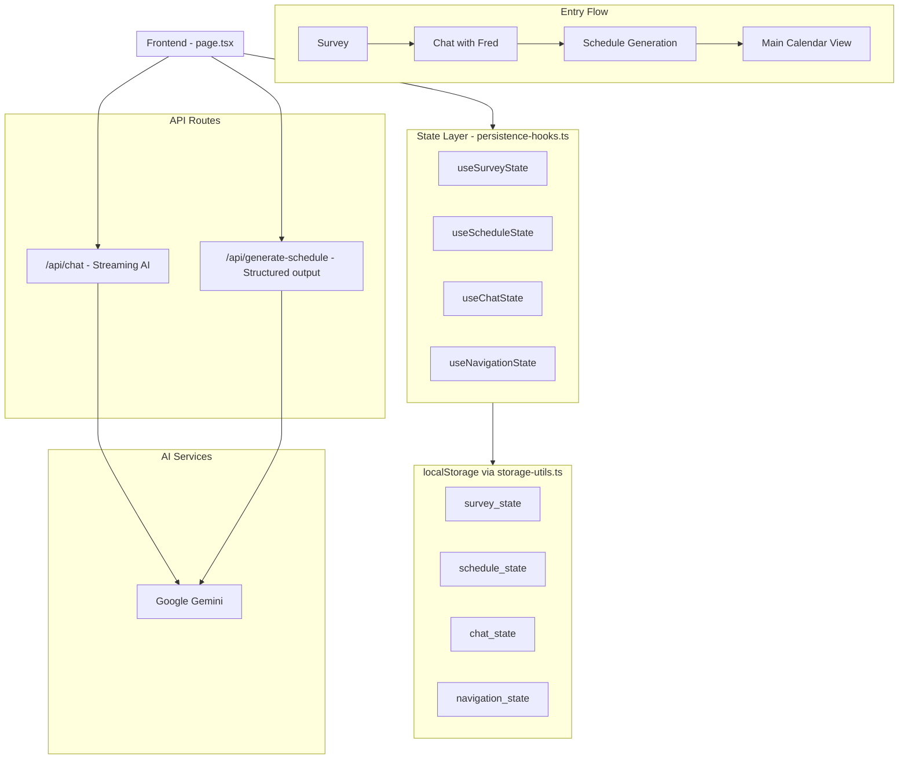
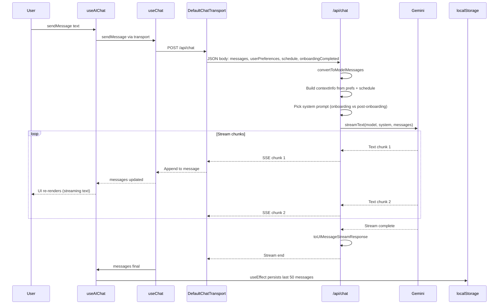
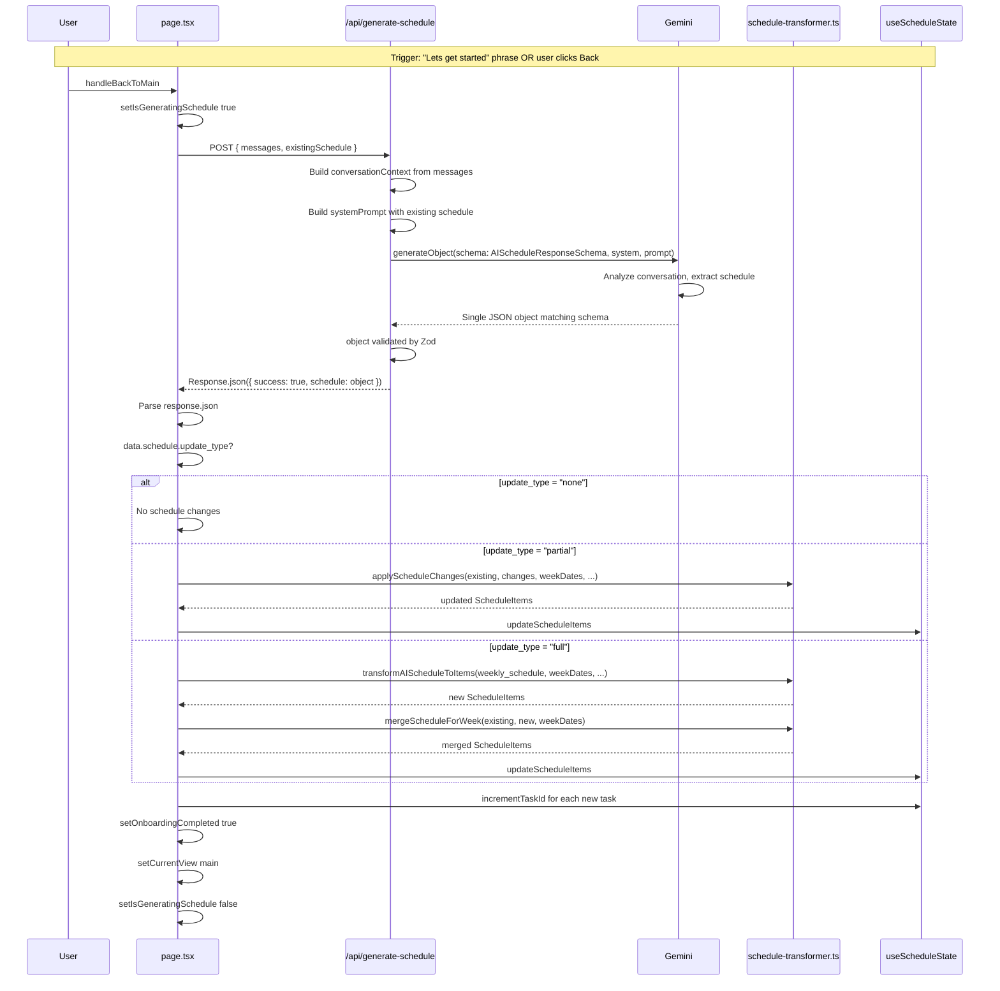
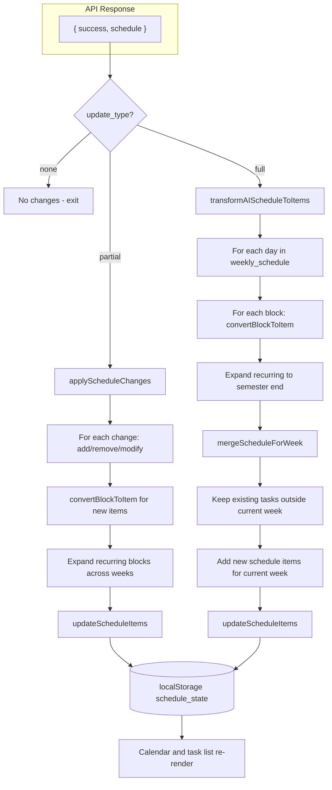
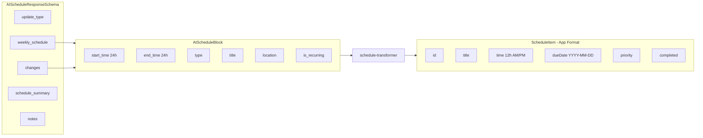

# Architecture

## 1. What this project does
This application features a scheduling assistant for Washington State University. It helps students:
1. Personalize via an onboarding survey (productive hours, sleep habits, task preferences)
2. Chat with "Fred the Lion" (AI coach) to discuss classes, work, study time, and commitments
3. Generate a weekly schedule from the conversation
4. Manage tasks on a calendar (add, edit, complete, view by day)
The AI uses motivational interviewing to help students realize time constraints and collaboratively build a realistic schedule.

## 2. Tech Stack
| **Layer** | **Technology** |
| ----- | ---------- |
| Framework | Next.js 14 (App Router) |
| UI | React 19, Radix UI, Tailwind CSS |
| AI | Vercel AI SDK, Google Gemini 2.5 Flash |
| State | localStorage via custom hooks (no db) |
| Analytics | PostHog, Vercel Analytics
| Validation | Zod |
| Package Manager | pnpm |

## 3. High Level Architecture Diagram



## 4. Directory Structure and Responsibilities
```
app/
  api/
    chat/
      route.ts                 # Streaming chat with Fred (Gemini)
    generate-schedule/
      route.ts                 # Extracts structured schedule from conversation (Gemini)

  globals.css                  # Global styles
  layout.tsx                   # Root layout, theme setup, PostHog init
  page.tsx                     # SINGLE PAGE APP – all views are composed here
  providers.tsx                # App-wide providers (PostHog, etc.)

components/
  theme-provider.tsx           # Dark / light mode handling
  ui/                          # Radix-based UI primitives
    button.tsx
    card.tsx
    dialog.tsx
    slider.tsx

lib/
  schemas.ts                   # Zod schemas, types, validation, user preference processing
  persistence-hooks.ts         # Client state hooks (survey, schedule, chat, navigation)
  storage-utils.ts             # Local storage helpers (save/load/clear)
  ai-chat-hook.ts              # useAIChat wrapper; adds context + calls /api/chat
  schedule-transformer.ts      # AI → ScheduleItems; merge + partial update logic
  core-utils.ts                # Re-exports for tests (backward compatibility)
  webhook-service.ts           # UNUSED – legacy n8n webhook integration
```

## 5. Application Views (All in page.tsx)
The app is a single-page app with conditional views based on state:
| **View** | **Trigger** | **Purpose** |
| ----- | ---------- | ------- |
| Survey | `showSurvey === true` | 6 Questions -> `userPreferences`
| Chat | `currentView === 'chat'` | AI Conversation with Fred |
| Task Editor | `showTaskEditor === true` | Add/Edit Task form |
| Main | default | Calendar, week picker, task list, Fred button |

## 6. Data Flow

### Survey -> Preferences
1. User completes survey; answers stored via `useSurveyState`
2. `processUserPreferences(surveyAnswers)` (in lib/schemas.ts) maps answers to `UserPreferences`
3. `completeSurvey(preferences)` hides survey and sets `userPreferences`

### Schedule Data Shape
- **Internal**: `ScheduleItems` = `Record<'Mon'|'Tue'|...|'Sun', ScheduleItem[]>`
- **AI output**: `AIScheduleBlock` (24h times, type, title, `is_recurring`) → converted to `ScheduleItem` (12h time, priority, dueDate)
- Tasks can have `dueDate` (YYYY-MM-DD); tasks without `dueDate` are legacy and shown for all dates

### 7. Gemini Data Flows (Request -> Response)

There are two distinct flows to Google Gemini; each returns data differently.

---

## 7.1. Chat Flow: Streaming Text from Gemini

Chat uses `streamText` — Gemini returns **text chunks over a stream**, not a single JSON blob. The AI SDK pipes this to the frontend as Server-Sent Events.



**Key points:**

- **Request**: `messages`, `userPreferences`, `schedule`, `onboardingCompleted`
- **Gemini returns**: Raw text chunks (no schema)
- **Response format**: `ReadableStream` of SSE events (AI SDK `toUIMessageStreamResponse`)
- **Frontend**: `useChat` aggregates chunks into one assistant message and updates UI in real time
- **Storage**: `useEffect` in `useAIChat` saves trimmed messages to `fred-chat-messages-{sessionKey}`

---

## 7.2. Schedule Generation Flow: Structured Object from Gemini

Schedule uses `generateObject` — Gemini returns a **single JSON object** matching a Zod schema.



**Key points:**

- **Request**: `messages`, `existingSchedule`
- **Gemini returns**: One object matching `AIScheduleResponseSchema`:
  - `update_type`: `'none' | 'partial' | 'full'`
  - `weekly_schedule`: array of day schedules (for `full`)
  - `changes`: array of add/remove/modify ops (for `partial`)
  - `schedule_summary`: totals
  - `notes`: array of strings
- **Response format**: `Response.json({ success: true, schedule: object })`
- **Frontend**: Branches on `update_type` and uses `schedule-transformer.ts` to update state

---

## 7.3 Schedule Response → UI Flowchart

How the structured schedule from Gemini is turned into visible tasks:



---

## 7.4 Gemini Response Data Shapes

**Chat (streamText):**

- No schema. Response is plain text.
- AI SDK turns it into `UIMessage` with `parts: [{ type: 'text', text: '...' }]`.

**Schedule (generateObject):**



---

## 8. State Persistence (localStorage)


| Key                               | Hook                 | Contents                                                         |
| --------------------------------- | -------------------- | ---------------------------------------------------------------- |
| `coug_scheduler_survey_state`     | `useSurveyState`     | showSurvey, currentQuestionIndex, surveyAnswers, userPreferences |
| `coug_scheduler_schedule_state`   | `useScheduleState`   | scheduleItems, nextTaskId                                        |
| `coug_scheduler_chat_state`       | `useChatState`       | messages (legacy), onboardingCompleted                           |
| `coug_scheduler_navigation_state` | `useNavigationState` | currentDate, selectedDay, currentView                            |
| `fred-chat-messages-{sessionKey}` | `useAIChat`          | Chat messages per session (separate from chat_state)             |


---

## 9. Key Concepts

- **Fred vs Butch**: Fred is the in-app AI; Butch is WSU mascot (images use butch-cougar.png)
- **Onboarding vs Post-Onboarding**: Different system prompts; post-onboarding is more casual check-in style
- **Session Key**: Each chat open creates a new session; messages are stored per `sessionKey`
- **Recurring vs One-Time**: AI blocks with `is_recurring: true` are expanded across all weeks until semester end

---

## 10. Unused / Legacy Code

- **webhook-service.ts**: n8n webhook integration; not imported anywhere. App uses `/api/chat` instead.
- **README**: Describes n8n + webhook deployment; current deployment uses Next.js API routes directly.

---

## 11. Environment Variables

- `NEXT_GEMINI_API_KEY`: Required for chat and schedule generation
- `NEXT_PUBLIC_N8N_WEBHOOK_URL`: Optional; only used if webhook-service were integrated

---

## 12. Where to Start Reading

1. [app/page.tsx](app/page.tsx) – Entry point and view orchestration
2. [lib/persistence-hooks.ts](lib/persistence-hooks.ts) – State management pattern
3. [app/api/chat/route.ts](app/api/chat/route.ts) – Chat system prompt and streaming
4. [app/api/generate-schedule/route.ts](app/api/generate-schedule/route.ts) – Schedule extraction
5. [lib/schedule-transformer.ts](lib/schedule-transformer.ts) – AI output → UI schedule

