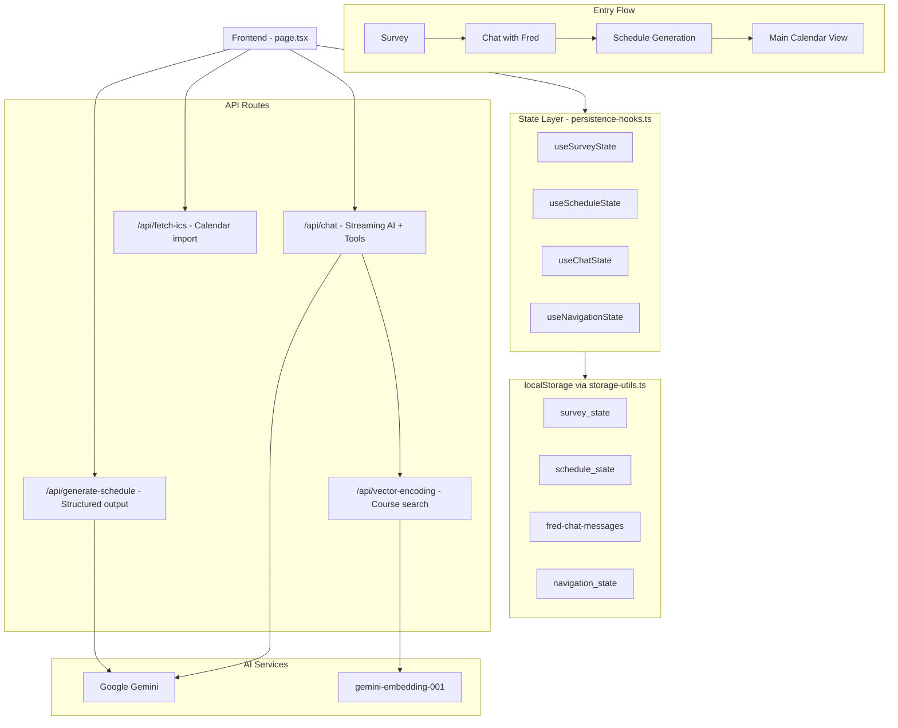
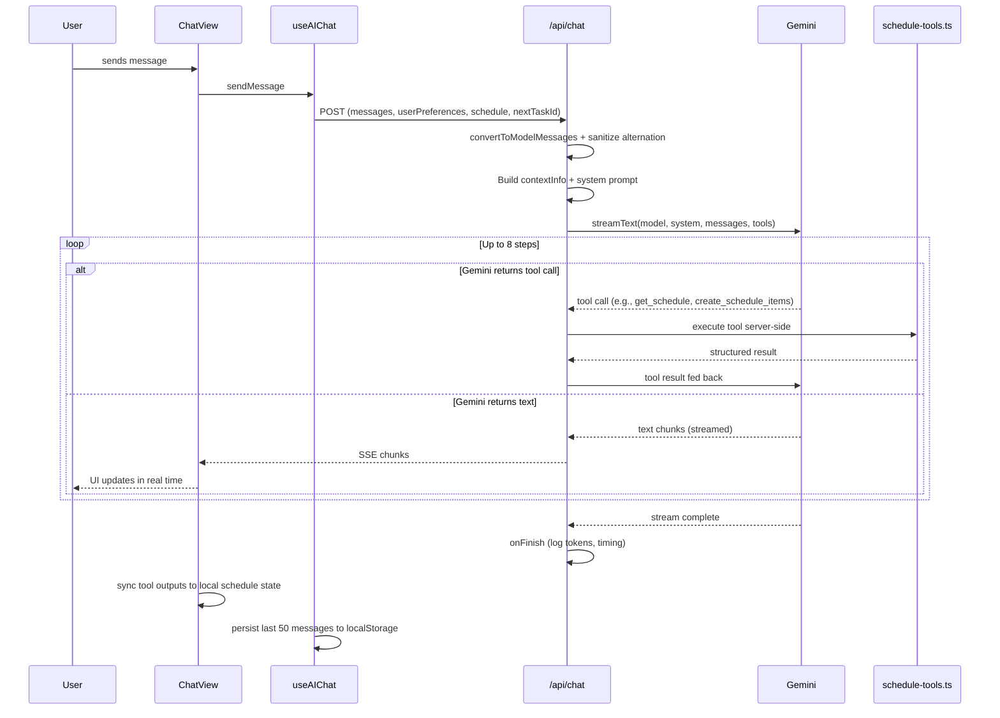
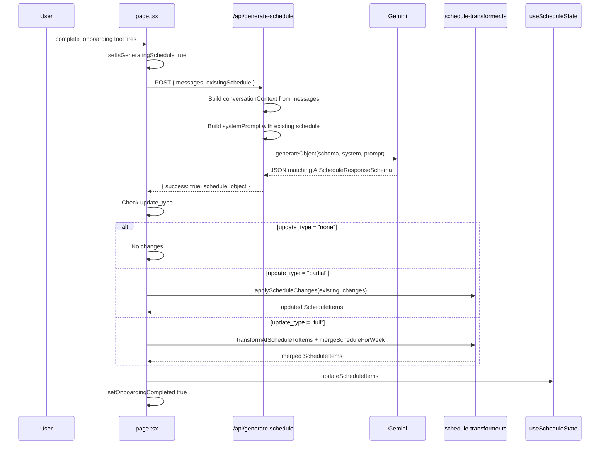
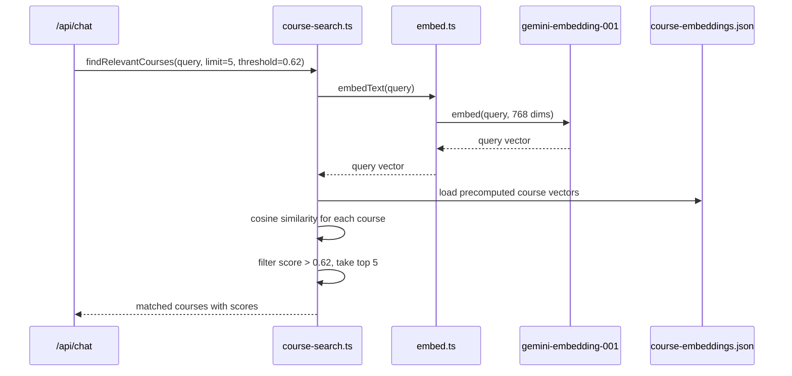

# Architecture

## 1. What This Project Does

This application is a scheduling assistant for Washington State University students. It helps students:

1. Personalize via an onboarding survey (productive hours, sleep habits, task preferences)
2. Chat with "Fred the Lion" (AI coach) to discuss classes, work, study time, and commitments
3. Search the WSU course catalog using semantic vector search
4. Build a weekly schedule collaboratively through AI tool calls (create, remove, check conflicts)
5. Import external calendars via iCal/ICS feeds
6. Manage tasks on a date-keyed calendar (add, edit, complete, delete, view by day)

The AI uses motivational interviewing to help students realize time constraints and collaboratively build a realistic schedule.

## 2. Tech Stack

| Layer | Technology |
| ----- | ---------- |
| Framework | Next.js (App Router) |
| UI | React, Radix UI (shadcn/ui), Tailwind CSS |
| AI | Vercel AI SDK (`streamText`, `generateObject`, tool calling), Google Gemini |
| Embeddings | `@google/genai` with `gemini-embedding-001` (768 dimensions) |
| State | localStorage via custom hooks (no database) |
| Analytics | PostHog, Vercel Analytics |
| Validation | Zod |
| Package Manager | pnpm |

The Gemini model is configurable in `lib/constants.ts` — supports `gemini-2.5-flash`, `gemini-3-flash-preview`, and `gemini-3.1-flash-lite-preview`.

## 3. High-Level Architecture


```mermaid
flowchart TB
    subgraph Entry [Entry Flow]
        A[Survey] --> B[Chat with Fred]
        B --> C[Schedule Generation]
        C --> D[Main Calendar View]
    end

    subgraph Frontend [Frontend - page.tsx]
        A
        B
        C
        D
    end

    subgraph State [State Layer - persistence-hooks.ts]
        H1[useSurveyState]
        H2[useScheduleState]
        H3[useChatState]
        H4[useNavigationState]
    end

    subgraph Storage [localStorage via storage-utils.ts]
        S1[survey_state]
        S2[schedule_state]
        S3[fred-chat-messages]
        S4[navigation_state]
    end

    subgraph API [API Routes]
        API1["/api/chat - Streaming AI + Tools"]
        API2["/api/generate-schedule - Structured output"]
        API3["/api/fetch-ics - Calendar import"]
        API4["/api/vector-encoding - Course search"]
    end

    subgraph AI [AI Services]
        G1[Google Gemini]
        G2[gemini-embedding-001]
    end

    Frontend --> State
    State --> Storage
    Frontend --> API1
    Frontend --> API2
    Frontend --> API3
    API1 --> G1
    API1 --> API4
    API2 --> G1
    API4 --> G2
```

## 4. Directory Structure

```
app/
  api/
    chat/route.ts                  # Streaming chat with tool calling (Gemini)
    generate-schedule/route.ts     # Structured schedule extraction (Gemini generateObject)
    fetch-ics/route.ts             # Server-side ICS calendar fetch (CORS bypass)
    vector-encoding/
      route.ts                     # Semantic course search API endpoint
      course-search.ts             # Cosine similarity search over embeddings
      embed.ts                     # Text embedding (768-dim via gemini-embedding-001)
      format-courses.ts            # Course data → prompt formatting
      data/courses.json            # WSU course catalog (~61K lines)
      data/course-embeddings.json  # Precomputed embeddings (~14.5M lines)
      Scripts/
        generate-embeddings.ts     # Regenerate embeddings script
        Scrape-WSU-Courses.ps1     # WSU catalog scraper

  globals.css                      # Global styles + responsive media queries
  layout.tsx                       # Root layout, theme setup, PostHog init
  page.tsx                         # Single-page app — all views composed here
  providers.tsx                    # App-wide providers (PostHog)

ui/
  views/
    ChatView.tsx                   # Chat UI, tool-call sync, auto-retry on empty responses
    MainView.tsx                   # Calendar, week picker, sorted task list, add-task button
    SurveyView.tsx                 # Onboarding survey (6 questions)
    TaskEditorView.tsx             # Add/edit/delete tasks with recurring support
  components/                      # shadcn/ui primitives (button, card, dialog, slider)
  theme-provider.tsx               # Dark/light mode handling

lib/
  ai-chat-hook.ts                  # useAIChat — wraps AI SDK useChat with localStorage persistence
  constants.ts                     # Gemini models, days, months, semester dates, survey questions, AI config
  ical-parser.ts                   # ICS feed parsing and schedule integration
  persistence-hooks.ts             # Client state hooks (survey, schedule, chat, navigation)
  schedule-tools.ts                # Tool input schemas (Zod) + server-side execute functions
  schedule-transformer.ts          # AI schedule output → ScheduleItems conversion + merging
  schemas.ts                       # Zod schemas and TypeScript types for all app data
  storage-utils.ts                 # localStorage helpers (save/load/clear/migrate)
  utils.ts                         # Date formatting utilities (formatDateLocal, getWeekDates)
  webhook-service.ts               # UNUSED — legacy n8n webhook integration (not imported)
```

## 5. Application Views

The app is a single-page app with conditional views based on state (all orchestrated in `page.tsx`):

| View | Trigger | Component | Purpose |
| ---- | ------- | --------- | ------- |
| Survey | `showSurvey === true` | `SurveyView` | 6-question onboarding → `userPreferences` |
| Chat | `currentView === 'chat'` | `ChatView` | AI conversation with Fred (tool calling) |
| Task Editor | `showTaskEditor === true` | `TaskEditorView` | Add/edit/delete individual tasks |
| Main | default | `MainView` | Calendar, week picker, sorted task list, Fred button |

## 6. Data Flow

### Survey → Preferences

1. User completes survey; answers stored via `useSurveyState`
2. `processUserPreferences(surveyAnswers)` maps answers to `UserPreferences`
3. `completeSurvey(preferences)` hides survey and sets `userPreferences`

### Schedule Data Shape

- **Storage key**: `ScheduleItems = Record<string, ScheduleItem[]>` where keys are dates in `YYYY-MM-DD` format
- **AI tool output**: Items created via `create_schedule_items` include `title`, `date`, `start_time` (required) plus optional `end_time`, `type`, `location`, `is_recurring`
- **AI generateObject output**: `AIScheduleBlock` (24h times, type, title, `is_recurring`) → converted to `ScheduleItem` (12h time, priority, dueDate)
- Tasks are sorted by start time for display

---

## 7. Gemini Data Flows

There are three distinct flows to Google Gemini.

### 7.1. Chat Flow: Streaming Text + Tool Calling

Chat uses `streamText` with tools. Gemini can return text chunks, tool call requests, or both across multiple steps (up to 8 steps via `stopWhen: stepCountIs(8)`).


```mermaid
sequenceDiagram
    participant User
    participant ChatView
    participant useAIChat
    participant API as /api/chat
    participant Gemini
    participant Tools as schedule-tools.ts

    User->>ChatView: sends message
    ChatView->>useAIChat: sendMessage
    useAIChat->>API: POST (messages, userPreferences, schedule, nextTaskId)

    API->>API: convertToModelMessages + sanitize alternation
    API->>API: Build contextInfo + system prompt
    API->>Gemini: streamText(model, system, messages, tools)

    loop Up to 8 steps
        alt Gemini returns tool call
            Gemini-->>API: tool call (e.g., get_schedule, create_schedule_items)
            API->>Tools: execute tool server-side
            Tools-->>API: structured result
            API->>Gemini: tool result fed back
        else Gemini returns text
            Gemini-->>API: text chunks (streamed)
            API-->>ChatView: SSE chunks
            ChatView-->>User: UI updates in real time
        end
    end

    Gemini-->>API: stream complete
    API->>API: onFinish (log tokens, timing)

    ChatView->>ChatView: sync tool outputs to local schedule state
    useAIChat->>useAIChat: persist last 50 messages to localStorage
```

**Available tools:**

| Tool | Required Fields | Optional Fields | Server-Side Action |
| ---- | --------------- | --------------- | ------------------ |
| `get_schedule` | (none) | — | Returns full `scheduleItems` from request body |
| `create_schedule_items` | `title`, `date` or `day`, `start_time` | `end_time`, `type`, `is_recurring`, `location` | Validates, checks overlaps, returns created items |
| `remove_schedule_items` | `match_titles` | `day` | Filters schedule by title match, returns removed count |
| `search_courses` | `query` | `limit` | Semantic search over WSU course embeddings |
| `complete_onboarding` | (none) | — | Triggers `generateObject` for full schedule generation |

**Client-side sync (ChatView.tsx):**
- After `create_schedule_items` succeeds, created items are added to local `scheduleItems` state
- After `remove_schedule_items` succeeds, matching items are filtered from local state
- Tool call status messages are shown in the chat during AI reasoning loops

**Auto-retry:**
If Gemini returns an empty response (no text, no tool calls), the client strips trailing unanswered user messages and retries up to 3 times.

---

### 7.2. Schedule Generation Flow: Structured Object

Schedule generation uses `generateObject` — Gemini returns a single JSON object matching a Zod schema. This is triggered by the `complete_onboarding` tool call.


```mermaid
sequenceDiagram
    participant User
    participant page as page.tsx
    participant API as /api/generate-schedule
    participant Gemini
    participant Transformer as schedule-transformer.ts
    participant State as useScheduleState

    User->>page: complete_onboarding tool fires
    page->>page: setIsGeneratingSchedule true
    page->>API: POST { messages, existingSchedule }

    API->>API: Build conversationContext from messages
    API->>API: Build systemPrompt with existing schedule
    API->>Gemini: generateObject(schema, system, prompt)

    Gemini-->>API: JSON matching AIScheduleResponseSchema
    API-->>page: { success: true, schedule: object }

    page->>page: Check update_type

    alt update_type = "none"
        page->>page: No changes
    else update_type = "partial"
        page->>Transformer: applyScheduleChanges(existing, changes)
        Transformer-->>page: updated ScheduleItems
    else update_type = "full"
        page->>Transformer: transformAIScheduleToItems + mergeScheduleForWeek
        Transformer-->>page: merged ScheduleItems
    end

    page->>State: updateScheduleItems
    page->>page: setOnboardingCompleted true
```

---

### 7.3. Course Search Flow: Vector Embeddings


```mermaid
sequenceDiagram
    participant Chat as /api/chat
    participant Search as course-search.ts
    participant Embed as embed.ts
    participant Gemini as gemini-embedding-001
    participant Data as course-embeddings.json

    Chat->>Search: findRelevantCourses(query, limit=5, threshold=0.62)
    Search->>Embed: embedText(query)
    Embed->>Gemini: embed(query, 768 dims)
    Gemini-->>Embed: query vector
    Embed-->>Search: query vector

    Search->>Data: load precomputed course vectors
    Search->>Search: cosine similarity for each course
    Search->>Search: filter score > 0.62, take top 5
    Search-->>Chat: matched courses with scores
```

---

## 8. State Persistence (localStorage)

| Key | Hook / Module | Contents |
| --- | ------------- | -------- |
| `coug_scheduler_survey_state` | `useSurveyState` | showSurvey, currentQuestionIndex, surveyAnswers, userPreferences |
| `coug_scheduler_schedule_state` | `useScheduleState` | scheduleItems (date-keyed), nextTaskId |
| `coug_scheduler_chat_state` | `useChatState` | onboardingCompleted |
| `coug_scheduler_navigation_state` | `useNavigationState` | currentDate, selectedDay, currentView |
| `fred-chat-messages` | `useAIChat` | Unified chat messages (last 50, single conversation) |
| `coug_scheduler_calendar_urls` | `page.tsx` | Array of ICS feed URLs |
| `coug_scheduler_delete_task_dont_ask` | `TaskEditorView` | Boolean preference for delete confirmation dialog |

The "Reset All Data" button calls `clearAllStorage()`, which removes all keys above including chat history and the "don't ask again" preference.

---

## 9. Key Concepts

- **Fred vs Butch**: Fred is the in-app AI persona; Butch is the WSU mascot (images use `butch-cougar.png`)
- **Onboarding vs Post-Onboarding**: Different system prompts; onboarding is a detailed conversation to build a schedule, post-onboarding is a casual check-in with schedule management tools
- **Date-Keyed Storage**: Schedule items are keyed by `YYYY-MM-DD` strings, not day-of-week. Day names are calculated on the fly when needed
- **Recurring Tasks**: Items with `is_recurring: true` are expanded across all weeks until semester end during schedule generation
- **Unified Chat**: A single persistent conversation stored under `fred-chat-messages`, shared across all sessions and weeks
- **Tool Calling Loop**: The AI can chain up to 8 tool-call steps per user message (e.g., get schedule → check conflicts → create items → respond)
- **Message Sanitization**: The server collapses consecutive same-role messages before sending to Gemini to maintain strict alternating-turn format

---

## 10. Unused / Legacy Code

- **`lib/webhook-service.ts`**: n8n webhook integration; not imported anywhere. The app uses `/api/chat` with direct Gemini API calls instead.
- **`components/` directory**: Legacy UI components duplicated from `ui/components/`. The `ui/` directory is the active one.

---

## 11. Environment Variables

| Variable | Required | Description |
| -------- | -------- | ----------- |
| `NEXT_GEMINI_API_KEY` | Yes | Google Gemini API key for chat, schedule generation, and embeddings |

---

## 12. Where to Start Reading

1. [`app/page.tsx`](../app/page.tsx) — Entry point and view orchestration
2. [`lib/constants.ts`](../lib/constants.ts) — All configurable constants (model, semester, survey)
3. [`app/api/chat/route.ts`](../app/api/chat/route.ts) — Chat system prompt, tool definitions, streaming
4. [`lib/schedule-tools.ts`](../lib/schedule-tools.ts) — Tool input schemas and server-side execution
5. [`lib/persistence-hooks.ts`](../lib/persistence-hooks.ts) — State management pattern
6. [`app/api/generate-schedule/route.ts`](../app/api/generate-schedule/route.ts) — Structured schedule extraction
7. [`lib/ai-chat-hook.ts`](../lib/ai-chat-hook.ts) — Client-side chat hook with persistence
8. [`ui/views/ChatView.tsx`](../ui/views/ChatView.tsx) — Chat UI, tool sync, auto-retry logic
